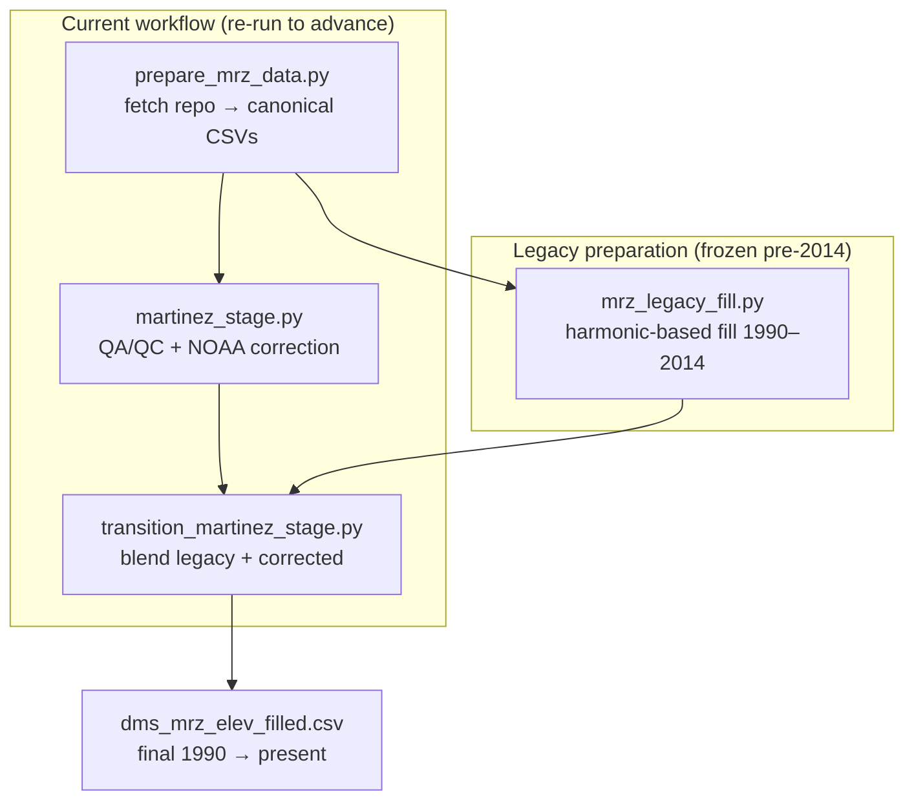
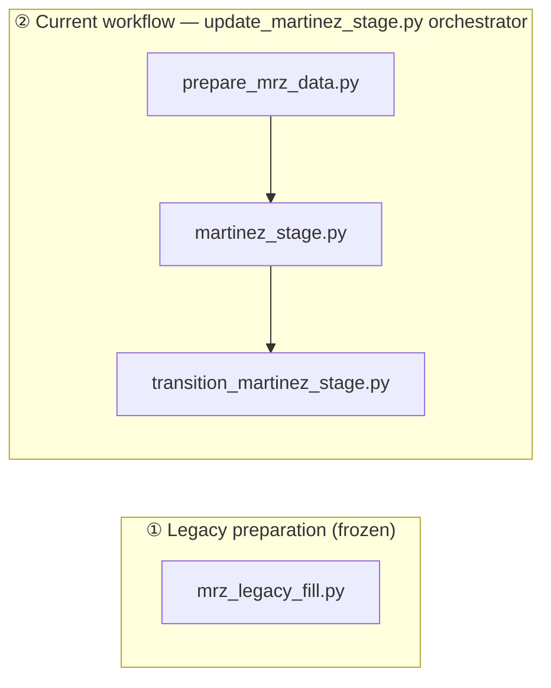
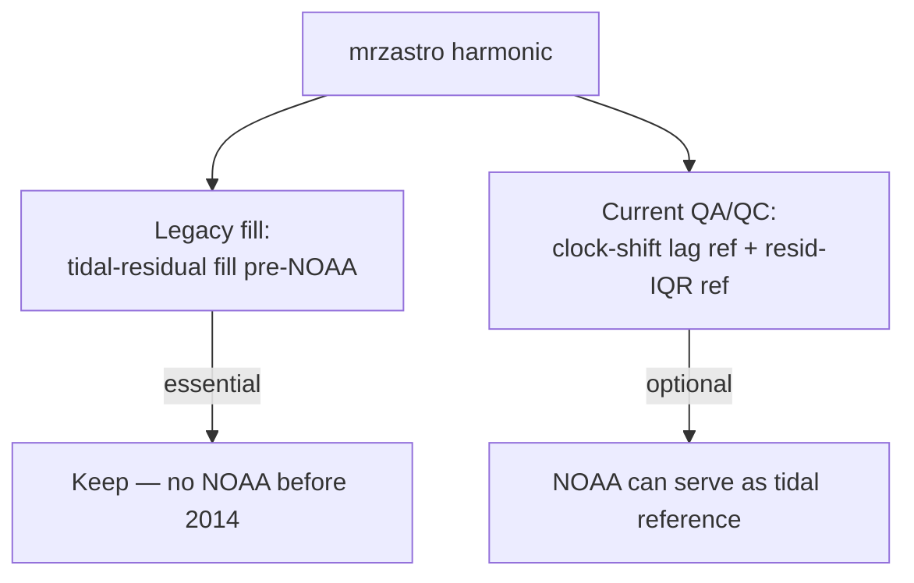
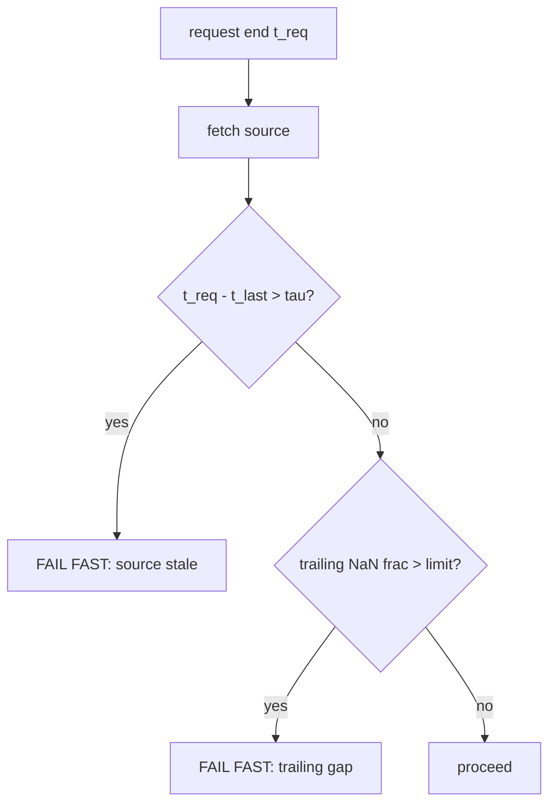

# Martinez Stage Filling — Workflow Documentation

Continuous, gap-filled Martinez (`mrz`) water-level series, 1990 → present, built by
splicing a **legacy harmonic-based fill** (pre-NOAA) onto a **NOAA-corrected QA/QC
series** (post-2013).

### Orientation — the mental model

Three ideas make the rest easy to read:

1. **DWR Martinez is the product; NOAA is the crutch.** The series we ship *is* the DWR
   gauge. NOAA Martinez–Amorco (~1 km away, effectively co-located) is a near-twin used to
   repair DWR — not to replace it.
2. **Two knobs do the correction.** A slowly varying vertical offset $\delta$ (month-scale
   datum difference, up to ~0.6 ft) between the two stations is removed before filling and added back after; and a
   single regression $\tilde z_{\text{DWR}} \approx a + b\,z_{\text{NOAA}}$ (tidal
   amplification $b \approx 1.01$) supplies tide inside gaps, with a smooth interpolated
   residual for the small leftover.
3. **Fixed 15-min grid, 1990 → present**, spliced from the frozen legacy fill (pre-2014) onto
   the NOAA-corrected series (post-2013) across a fixed Dec 2013 → Jan 2014 window.

NOAA actually pulls **triple duty** — it fills gaps, stabilizes drift, *and* is the comparator
for several of the QA "tripwires"; the harmonic is the tidal reference for the clock-shift and
residual-energy checks. The full reference-role map and a review checklist are in the
[Reviewer's guide](#8-reviewers-guide).

## 0. What to run (operator quick start)

The single entry point is **`update_martinez_stage.py`** — a Click CLI that
orchestrates `prepare → qaqc → transition` in-process, threading one `--end`
(an ISO date or `NOW`) through the whole pipeline. Use it first, then use the
[Reviewer's guide](#8-reviewers-guide) to assess quality.

### 0.1 Update run (normal operation; advances post-2013 to "now")

```bash
python update_martinez_stage.py run --end NOW
```

- `--end` accepts `NOW` or an ISO date (e.g. `--end 2026-08-08`); default is `NOW`.
- The frozen pre-NOAA legacy fill is **not** re-run unless `--rebuild-legacy` is given.
- Freshness guards are tunable per source: `--dwr-tau-days`, `--noaa-tau-days`,
  `--neighbor-tau-days`, `--trailing-nan-frac`.

Products updated by this run:

- `dms_mrz_elev_2013_9999.csv` (post-2013 corrected segment)
- `dms_mrz_elev_filled.csv` (final 1990→present stitched product)
- `martinez_flags.csv`, `martinez_intervals.csv`, `martinez_qaqc.png`,
  `martinez_qaqc_zoom.png`, `transition_martinez.png`

### 0.2 Full rebuild (only when legacy needs regeneration)

Use this only when bootstrapping from scratch or intentionally regenerating the
frozen legacy pre-2014 segment (`mrz_stage_filled_legacy.csv`):

```bash
python update_martinez_stage.py run --end NOW --rebuild-legacy
```

To regenerate only the legacy seed (rare):

```bash
python update_martinez_stage.py legacy
```

### 0.3 Individual stages (advanced / debugging)

The orchestrator also exposes each stage as its own subcommand:

```bash
python update_martinez_stage.py prepare --end NOW
python update_martinez_stage.py qaqc
python update_martinez_stage.py transition
```

These are equivalent to invoking the underlying scripts directly
(`prepare_mrz_data.py` → `martinez_stage.py` → `transition_martinez_stage.py`),
but the subcommands share the same `--end` / freshness handling as `run`.

## 1. High-level pipeline



The three producers write into a common set of canonical CSVs (single `value` column,
regular 15-min grid). Everything downstream assumes that grid and does **not** resample.

## 2. Drift-free ("aligned") frame

The post-NOAA correction never fills the DWR series in its raw datum. Instead it removes
a **slowly varying relative offset** between DWR and NOAA, fills in that drift-free frame,
then restores the offset. This keeps the DWR↔NOAA relationship approximately stationary
during filling so that a regression/interpolation against NOAA is not biased by slow datum
creep (sensor re-referencing, biofouling, benchmark drift).

**Definitions.** Let $z_{\text{DWR}}$ and $z_{\text{NOAA}}$ be the 15-min series. The
subtidal component uses a 40-hour cosine-Lanczos filter $\mathcal{L}_{40\text{h}}$:

$$
z^{\text{sub}} = \mathcal{L}_{40\text{h}}[z].
$$

The relative offset is a **robust, doubly-smoothed** median of the subtidal difference:

$$
\delta(t) = \operatorname{med}_{10\text{d}}\!\Big(\operatorname{med}_{45\text{d}}\big[\,z^{\text{sub}}_{\text{DWR}} - z^{\text{sub}}_{\text{NOAA}}\,\big]\Big).
$$

- The **45-day** rolling median (`offset_win`) sets the *breadth* of the long-term drift
  estimate — wide enough to ignore spring/neap and weather-band energy and isolate
  month-scale datum drift.
- The **10-day** rolling median (`offset_smooth_win`) removes residual steppiness so
  $\delta$ is smooth where it is added back.

**Fill in the aligned frame, then restore:**

$$
\tilde{z}_{\text{DWR}} = z_{\text{DWR}} - \delta,
\qquad
z^{\text{corr}} = \operatorname{Fill}_{\text{NOAA}}\!\big[\tilde{z}_{\text{DWR}}\big] + \delta .
$$

Filling uses `fill_from_neighbor(..., method="resid_interp_pchip")`: fit a baseline
$\tilde{z}_{\text{DWR}} \approx a + b\,z_{\text{NOAA}}$ on good overlap, then PCHIP-interpolate
the residuals across masked gaps. Because $\delta$ is added back, the reconstruction stays
in the DWR frame.

**What counts as a "gap".** The spans that get filled are of two distinct kinds:

1. **Genuinely missing reported data** — telemetry holes in the DWR feed (beyond the short
   4-step interpolation limit used for tiny gaps).
2. **Data removed by anomaly detection** — the QA/QC intervals (clock shift, residual-IQR
   spike, flat derivative, subtidal disagreement) that are *masked to NaN before filling*.

Both are reconstructed the same way from NOAA, so a "filled" sample may reflect either a
*missing* reading or a *rejected* one. The QA-removed subset is recorded in the
`bad_dwr_fill` column of `martinez_flags.csv` (and shaded in the QA/QC plot), so a reviewer can
always tell which gaps were holes vs. which were deliberately cut.

> Tunable breadth: the 45 d / 10 d pair is the single most important "how long is long-term"
> choice. Narrower windows track drift more aggressively (and risk absorbing real signal);
> wider windows are more conservative.

### 2.1 What the neighbor fill does in each frequency band

MRZ (DWR) and NOAA Martinez–Amorco are ~1 km apart in the same channel — effectively
co-located — so the single regression $\tilde z_{\text{DWR}} \approx a + b\,z_{\text{NOAA}}$
does most of the work, and it behaves cleanly in **both** bands.

- **Tidal band — supplied directly by NOAA.** Inside a gap the oscillation is
  $b\,z_{\text{NOAA}}(t)$: the observed NOAA tide scaled by the amplification $b$. As reported
  by the QA/QC run log (see [§8.5](#85-one-independent-check--read-it-from-the-run-log)),
  $b \approx 1.02$, $a \approx -0.07$ ft, $R^2 \approx 0.998$ ($\sim\!4\times10^{5}$ overlap
  points); an independent tidal-band std ratio gives $\approx 1.015$. So Martinez runs ~1–2%
  *higher* tidal amplitude than Amorco — small, but **not** unity, and the fit captures it.
  There is **no phase-lag term** (the regression is contemporaneous), so any MRZ↔NOAA phase
  difference lands in the residual; because PCHIP only smooths that residual across a gap, the
  reconstructed tide follows **NOAA's phase**. Fine for short gaps; a persistent fixed lag
  would be a small systematic tidal-phase error.

- **Subtidal band — small once δ is removed.** After the slow offset δ is subtracted, the
  residual subtidal difference is tiny: IQR $\approx 0.02$ ft and 95th-percentile
  $|\Delta| \approx 0.06$ ft — right at the `subdiff_abs_thresh` $= 0.07$ ft flag. δ itself
  carries the real, month-scale datum difference (range $\approx -0.23 \ldots +0.64$ ft). So
  the residual PCHIP must interpolate across a gap is small and slowly varying — the reason
  this one-shot full-resolution fill works where the legacy path needed an explicit subtidal
  model. (The larger *std* of the aligned difference, $\approx 0.14$ ft, is heavy-tailed from
  transient bad-sensor excursions — the anomalies QA masks, not real disagreement.)

**Edge behavior.** The 40 h subtidal filter NaNs the last $\approx 4$ days (its half-width),
but the corrected product still reaches the requested end: δ is a `min_periods=1` centered
rolling median, so it extends to the tip using the most recent valid subtidal difference, and
the fill rides on full-resolution DWR. Treat the trailing ~4 days as **provisional** — the
drift term is effectively *held* rather than freshly estimated, and subtidal-dependent QA
(subtidal-disagreement, clock-shift lag) is blind there. This is a soft limit, not a hard
truncation, and is far smaller than NOAA repo staleness (tens of days) as a practical bound on
how recent `--end` can be.

> These regression stats ($a$, $b$, $R^2$, $\sigma_{\text{resid}}$, overlap count) are computed
> inside `fill_from_neighbor` (returned in `model_info`) and **printed to the run log** by the
> QA/QC step — see the [Reviewer's guide §8.5](#85-one-independent-check--read-it-from-the-run-log).

## 3. The Trimbur / dynamic factor model (DFM) smoother

The legacy subtidal fill is polished with a **bivariate dynamic factor model** (`DFMFill`
in `vtools.functions.neighbor_fill`, a `statsmodels` state-space `MLEModel`). This will be
unfamiliar to most users, so a short primer:

A DFM assumes two observed series — here the target subtidal (Martinez) and a neighbor
subtidal (San Francisco) — are driven by a **shared latent factor** plus series-specific
anomalies and measurement noise. The shared factor is a *local-linear trend* (a smoothly
evolving level $\mu_t$ with slope $\beta_t$):

$$
\mu_{t+1} = \mu_t + \beta_t + \eta^\mu_t, \qquad
\beta_{t+1} = \beta_t + \zeta_t,\;\; \zeta_t \sim \mathcal{N}(0, q_\beta).
$$

$$
\underbrace{y_t}_{\text{Martinez}} = \mu_t + a^y_t + \varepsilon^y_t, \qquad
\underbrace{x_t}_{\text{SF}} = \lambda\,\mu_t + a^x_t + \varepsilon^x_t .
$$

The **Trimbur** variant fixes the level-shock variance to zero ($\operatorname{Var}(\eta^\mu)=0$),
so all roughness enters through the slope $\beta$. This yields an *integrated random walk* —
a smooth, twice-integrated trend that behaves like a cubic-spline-in-time rather than a jagged
random walk. The loading $\lambda$ lets SF and Martinez have different amplitudes; the
anomaly terms $a^y, a^x$ (random-walk `_rw` or AR(1) `_ar`) absorb station-specific behavior
so the neighbor does not contaminate the target.

In practice the model is fit **once** by maximum likelihood (Kalman filter + smoother), and
the estimated parameters are packed into `dfm_trimbur_rw_mrz_sfsub.yaml`. Subsequent runs
pass `params=` to **skip fitting** and just run the smoother — fast and reproducible. In the
legacy script the fit is gated by `do_fit=False`; the current legacy module always loads the
saved YAML.

## 4. Script categorization



### ① Legacy preparation — frozen, correct, do **not** re-run to advance

- **`mrz_legacy_fill.py`** produces `mrz_stage_filled_legacy.csv`, covering
  1990 → `NOAA_START = 2014-05-10`. Its domain is historical and fixed; advancing the
  present does not change it. Inputs: `dms_mrz_cleaned_1990_2017.csv`, harmonic, SF, MAL,
  and `dfm_trimbur_rw_mrz_sfsub.yaml`.

### ② Current workflow — re-run to advance to the current year

Driven by the **`update_martinez_stage.py`** orchestrator
(see [§0](#0-what-to-run-operator-quick-start)), which runs these stages in order:

1. **`prepare_mrz_data.py`** — fetch from `dms_datastore` and write canonical CSVs.
2. **`martinez_stage.py`** — QA/QC diagnostics (clock-shift lag, residual-IQR spike,
   flat-derivative/stuck-sensor, subtidal disagreement, gap count), mask + NOAA fill in the
   aligned frame → `dms_mrz_elev_2013_9999.csv`, `martinez_flags.csv`, `martinez_intervals.csv`.
3. **`transition_martinez_stage.py`** — `transition_ts` blend over
   `2013-12-20 → 2014-01-01` → `dms_mrz_elev_filled.csv`.

No manual rename is needed in the current scripts: `mrz_legacy_fill.py` writes
`mrz_stage_filled_legacy.csv`, and `transition_martinez_stage.py` reads that same file.

### ③ Production file set vs extraneous files

Use this as the retention policy when cleaning the workspace.

**Directory layout.** The pipeline is organized into three tiers (centralized in
`paths.py`) so frozen inputs, per-run scratch, and deliverables stay separate:

- **`data/` — frozen, deployable inputs.** Version-controlled artifacts that are
  never cleared automatically: the harmonic source (`mrzastro_1920_2035.csv`), the
  hand-cleaned legacy record (`dms_mrz_cleaned_1990_2017.csv`), the DFM parameters
  (`dfm_trimbur_rw_mrz_sfsub.yaml`), and the frozen pre-2014 legacy fill
  (`mrz_stage_filled_legacy.csv`). The legacy fill is only rewritten on an explicit
  `--rebuild-legacy` / `legacy` run.
- **`session_data/` — ephemeral per-run fetches.** The sliced source series that
  `prepare` fetches from the repo each run: `mrz_dwr_repo.csv`, `mrz_harmonic.csv`,
  `mrz_noaa_martinez.csv`, `sf_stage.csv`, `mal_stage.csv`. The whole directory is
  **cleared and respawned at the start of every `prepare` run** and is excluded from
  deployment — never hand-edit or depend on its contents between runs.
- **`output/` — products.** Final and review deliverables: `mrz_stage_filled_legacy`
  stitch inputs, `dms_mrz_elev_2013_9999.csv`, `dms_mrz_elev_filled.csv`, and the
  QA/review artifacts (`martinez_flags.csv`, `martinez_intervals.csv`,
  `martinez_qaqc.png`, `martinez_qaqc_zoom.png`, `transition_martinez.png`).

Keep (required inputs, generated intermediates, and final products):
- Scripts: `update_martinez_stage.py`, `prepare_mrz_data.py`, `martinez_stage.py`,
  `transition_martinez_stage.py`, `mrz_legacy_fill.py`, `paths.py`
- Everything under `data/`, plus the products written to `output/`.
- `session_data/` is regenerated by `prepare`; its contents are disposable but the
  directory itself is expected.

Safe to archive/remove (obsolete names or transient junk not read by current scripts):
- Obsolete-name product: `dms_mrz_stage_filled_legacy_1990_2013.csv`
  (current scripts read/write `data/mrz_stage_filled_legacy.csv`)
- Transient / editor / OS junk: `run_out.txt` (captured stdout), `Thumbs.db`,
  `__pycache__/`

Recommended cleanup approach:
- Move candidate files to an archive folder first (for example `archive/`), run §0.1,
  and confirm outputs and plots are unchanged except for the expected new end-date extension.

## 5. Hardwire audit — which constants are OK, which are not

| Hardwire | Location | Verdict | Rationale |
|---|---|---|---|
| `NAVD = 2.68`, `to_navd = 2006-01-01` | prepare / legacy | ✅ OK | Physical datum correction |
| `NOAA_START` (2013 / 2014-05-10) | prepare / legacy | ✅ OK | Real gauge-availability boundary |
| Transition window `2013-12-20 → 2014-01-01` | transition | ✅ OK | Fixed physical splice point |
| `M2FT` unit conversion | prepare | ✅ OK | Physical constant |
| Legacy fill `end = NOAA_START` | legacy | ✅ OK | Legacy domain is frozen |
| **`end = 2026-01-02`** | `prepare_mrz_data.py` | ❌ Config | The moving cutoff — must be a parameter |
| ~~Year-stamped CSV names~~ | prepare / all readers | ✅ Resolved | Now un-dated names under `session_data/` (see below) |

**Key distinction (resolved).** The **fetches themselves** —
`read_ts_repo("mrz", "elev", "upper", …)`, `"mrz2"`, `"sffpx"`, `"mal"` — are best
practice and stay. The earlier problem was that their **outputs had been named after a
year**, so a live-updating fetch written to a `_2025` file lied the moment the data
advanced. That is now fixed: `prepare` writes stable, un-dated names into the ephemeral
`session_data/` directory (`mrz_dwr_repo.csv`, `mrz_noaa_martinez.csv`, `sf_stage.csv`,
`mal_stage.csv`, `mrz_harmonic.csv`), with `start`/`end` as parameters. The old
year-stamped duplicates have been deleted.

## 6. Do we still need harmonic estimates?



- **Legacy (pre-2014): essential.** There is no NOAA gauge, so the harmonic reconstruction
  is the only independent tidal reference for filling the tidal residual band.
- **Current (post-2013): optional.** Harmonic is used only as a *reference* — for the
  windowed clock-shift lag (`ztid_harm`) and the residual-IQR spike diagnostic. NOAA already
  provides an independent, observed tidal reference and could take over both roles.
- **Recommendation:** keep harmonic on the legacy path; treat it as an *optional diagnostic*
  on the current path. It is cheap and useful precisely when NOAA is also suspect, so a full
  removal is a judgment call.

## 7. Automation & fail-fast on stale data

When runs are automated, `end` changes every invocation while the legacy system stays fixed.
That is fine — only steps ① prepare → ② QA/QC → ③ transition re-run. The real risk is a
**silent short-fetch**: if you request `end = 2026-08-05` but a source has not updated,
`read_ts_repo` simply returns a series that ends earlier, and everything downstream succeeds
on truncated data.

**Where the current code is blind.** `prepare_mrz_data.py` only checks the NOAA *start*
(`df_noaa.index.min() < NOAA_START - 7d`). Nothing checks the *end* / freshness of any source.

**Proposed guard.** For each fetched source with last valid timestamp $t_{\text{last}}$,
requested end $t_{\text{req}}$, and per-source tolerance $\tau$:

$$
t_{\text{req}} - t_{\text{last}} > \tau \;\Rightarrow\; \textbf{fail (or warn)}.
$$

Each source's tolerance $\tau$ should reflect that feed's real update latency, which we have
not yet characterized empirically — so $\tau$ is a **separately tunable per-source parameter**
rather than a fixed assumption. Start with a small default and loosen only for a source that
demonstrably lags; if a run chokes on a healthy feed, widen that source's $\tau$. (Avoid
baked-in guesses about relative NOAA vs. DWR latency; set them from observed behavior.)
Two failure modes to catch:

1. **Trailing shortfall** — the series ends well before $t_{\text{req}}$.
2. **Trailing gap** — the series *reaches* $t_{\text{req}}$ but the last stretch is mostly
   NaN. Guard with a max trailing-NaN fraction over, say, the final 7 days.



**Which sources warrant a hard fail vs a warning?**
- **Hard fail:** NOAA and DWR repo — they are on the critical fill/correction path; stale
  input silently corrupts the product.
- **Warn only:** SF and MAL — used as neighbors/gap-fillers; a short tail degrades but does
  not invalidate the fill, so a warning plus a recorded provenance note is enough.
- **N/A:** harmonic (`mrzastro`) extends to 2035 and is deterministic — no freshness concern.

## 8. Reviewer's guide

For a practitioner reviewing a run. Open, in order: `martinez_qaqc.png` (overview),
`martinez_qaqc_zoom.png` (last 21 days), `martinez_intervals.csv` (flagged spans + reasons),
`martinez_flags.csv` (per-timestamp diagnostics), `transition_martinez.png` (the 2013→2014
splice), and the products `dms_mrz_elev_2013_9999.csv` / `dms_mrz_elev_filled.csv`.

### 8.1 Which reference feeds which step

Each QA "tripwire" has a physical meaning and leans on a specific reference — knowing which
tells you *what* a flag is really asserting.

| Step / tripwire | Reference used | What it means when it fires |
|---|---|---|
| Gap fill (tide in gaps) | **NOAA** | tide reconstructed from NOAA (scaled by $b$) |
| Slow drift / offset $\delta$ | **NOAA** subtidal | month-scale datum difference removed then restored |
| Clock-shift lag | **Harmonic** tidal band | DWR timestamps/clock drifted vs. astronomical tide |
| Residual-IQR spike | **Harmonic** (DWR side) + **NOAA** (comparator) | DWR tidal-residual energy abnormally high (noisy sensor) |
| Flat-derivative | **NOAA** tidal band | DWR too smooth / stuck vs. NOAA (dead or corner-cut sensor) |
| Subtidal disagreement | **NOAA** subtidal | real low-frequency divergence (datum, biofouling) |
| Gap count | none (intrinsic DWR) | coverage / how much fill is being relied on |
| SF, MAL | **legacy path only** | pre-2014 neighbors; not used in modern QA |

> Subtlety: the residual-IQR ratio is not a clean like-for-like — the DWR residual is measured
> against the *harmonic* (`DWR − harmonic`) while the NOAA comparator uses *its own subtidal*
> (`NOAA − zsub_noaa`). It is calibrated empirically to its `resid_ratio_thresh = 0.3`, not
> physically unit-matched. If the harmonic is ever dropped from the modern path (see Open
> questions), NOAA would have to supply the DWR baseline too.

### 8.2 Reading the QA/QC plot (four panels)

| Panel | Healthy | Red flag |
|---|---|---|
| 1 — water level (raw / filtered / masked / **corrected** + NOAA + harmonic) | corrected tracks DWR where good; follows NOAA-shaped tide across shaded gaps with **no step at gap edges** | steps at gap edges; corrected diverging from *both* DWR and NOAA |
| 2 — best lag (min), ±40 min lines | scatter inside ±40 min | persistent excursion beyond ±40 min → clock/timestamp shift |
| 3 — variability ratios | resid-IQR ratio below 0.3; d/dt ratio above 0.42 | resid ≫ 0.3 → noisy DWR; d/dt ≪ 0.42 → too smooth / stuck |
| 4 — subtidal diff (DWR aligned − NOAA), ±0.07 ft | hugs zero, within ±0.07 ft | sustained excursion → real datum/biofouling disagreement |

### 8.3 Cross-file sanity checks

- **`offset_slow`** should be smooth and roughly within $-0.2 \ldots +0.6$ ft. A sudden jump is
  a datum/re-referencing event (investigate), not sensor noise.
- **Shaded intervals** in panel 1 must match rows in `martinez_intervals.csv`; skim the
  `reason` column and confirm each is plausible against the raw trace.
- **`gap_count` / `bad_dwr_fill`** — how much of the recent window is NOAA-filled vs. native
  DWR. Heavy recent fill → weight confidence accordingly.
- **Transition plot** — the blended line must be continuous across Dec 20 → Jan 1, no step.
- **Product files** — index monotonic, regular 15-min, no unexpected NaNs; `value` equals
  `mrz_elev_corrected`.

### 8.4 Three things to remember when interpreting

1. **The trailing ~4 days are provisional.** The 40 h subtidal filter cannot see them, so the
   drift term is *held* (not freshly estimated) and the subtidal/lag tripwires are blind there.
2. **Gap tide follows NOAA's phase**, not Martinez's (no phase-lag term). Fine for short gaps;
   be suspicious of long gaps during events.
3. **Freshness first.** Check the run log — if NOAA or DWR tripped the staleness guard the
   product is short/truncated and nothing downstream will warn you again.

### 8.5 One independent check — read it from the run log

The QA/QC step (`martinez_stage.run`) **prints the neighbor-fill regression** each run:

```
NOAA neighbor-fill regression (DWR_aligned ~ a + b*NOAA):
  b (tidal amplification) = 1.0189
  a (intercept, ft)       = -0.0692
  R^2                     = 0.99794
  sigma_resid (ft)        = 0.0741
  overlap points          = 399040
  overlap through         = 2026-06-28 00:00:00
```

Confirm $b \approx 1.0\text{–}1.02$, $a$ within a few hundredths of a foot, and
$R^2 \gtrsim 0.99$. A drifting $b$ or collapsing $R^2$ means the NOAA↔DWR relationship broke
and the fill can't be trusted — the run also prints a `[check]` warning line when $R^2 < 0.95$
or $|b-1| > 0.05$, so a bad fit is hard to miss.

